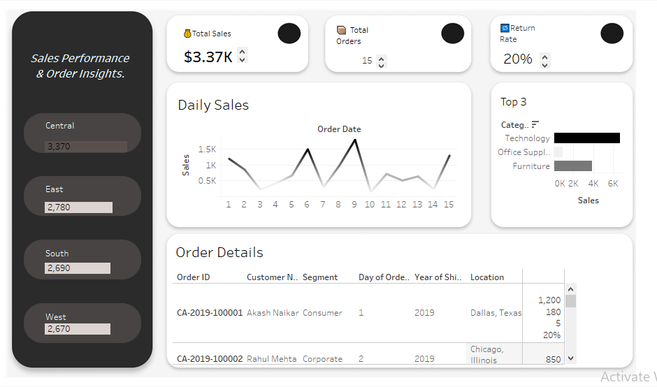

# 📊 Business Sales Intelligence Report

## 📌 Project Overview

This project presents an interactive Tableau solution designed to analyze business sales performance and order trends. It provides decision-makers with clear insights into revenue patterns, regional performance, and customer behavior using dynamic visualizations.

---

## 🎯 Project Objective

* Track overall business sales performance
* Monitor total orders and return rate
* Identify high-performing regions
* Analyze top-selling product categories
* Provide detailed order-level information

---

## 🛠 Tools & Technologies

* **Tableau Desktop** – Data visualization & dashboard creation
* **Microsoft Excel** – Data cleaning and preparation

---

## 📂 Dataset Information

The dataset includes:

* Order ID
* Customer Name
* Segment
* Order Date
* Ship Date
* Region
* Category
* Sales
* Return Rate

Source file used:
`regional_sales_tableau.xls.xlsx`

---

## 📁 Repository Files

* `Business_Sales_Report.twbx` – Tableau packaged workbook
* `regional_sales_tableau.xls.xlsx` – Dataset
* ## 📸 Dashboard Preview

* 

---

## 📈 Dashboard Highlights

* **KPI Cards**

  * Total Sales
  * Total Orders
  * Return Rate

* **Daily Sales Trend**

  * Line chart to track daily performance

* **Regional Performance**

  * Central, East, South, West sales comparison

* **Top Categories**

  * Bar chart showing top 3 product categories

* **Order Details Table**

  * Customer-wise order information

---

## 🔍 Key Business Insights

* Central region shows highest contribution to sales
* Technology category generates maximum revenue
* Sales patterns show periodic peaks
* Return rate maintained within acceptable range

---

## 🚀 How to Use

1. Clone or download the repository
2. Open `Business_Sales_Report.twbx` in Tableau Desktop
3. Use filters to explore data
4. Analyze trends and insights

---

## 💡 Skills Demonstrated

* Data analysis
* KPI calculation
* Interactive dashboard development
* Business storytelling
* Data visualization best practices

---

## 👨‍💻 Author

**Akash Dhanasekhar Naikar**
Aspiring Data Analyst

---

## 📌 Future Enhancements

* Profit analysis
* Monthly & quarterly trends
* Customer segmentation
* Mobile responsive dashboard

---

⭐ If you found this project helpful, please give it a star!
